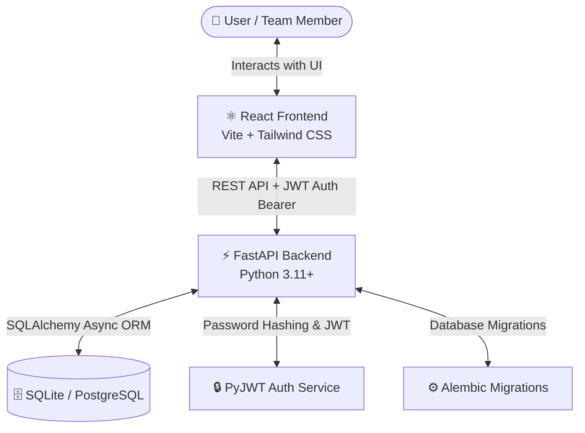

# 📋 Team Task Manager

A production-ready, full-stack **Team Task Manager** web application featuring robust **Role-Based Access Control (RBAC)**, interactive dashboards, dynamic project management, and real-time task assignments.

---

## 🏗️ System Architecture

The application is built on a decoupled full-stack architecture with a React-based client communicating via a JSON REST API with a FastAPI Python server.



---

## ⚡ Tech Stack

| Component | Technology | Description |
| :--- | :--- | :--- |
| **Frontend** | **React 18** | Fast interactive UI built with Vite |
| | **Tailwind CSS** | Premium modern styling & layouts |
| | **React Router v6** | Client-side routing and protected routes |
| | **Axios** | Promised-based HTTP client for API requests |
| **Backend** | **FastAPI** | High-performance Python async web framework |
| | **SQLAlchemy** | Async Database ORM |
| | **Alembic** | Database schema versioning and migrations |
| | **PyJWT & Passlib** | Secure JWT authentication & bcrypt password hashing |
| **Deployment**| **Docker** | Containerized backend builds |
| | **Railway** | Cloud hosting & automated deployment pipeline |

---

## 📂 Codebase Structure

```hl
team-task-manager/
├── backend/
│   ├── alembic/             # Database migration history
│   ├── app/
│   │   ├── routes/          # API endpoints (auth, projects, tasks, users)
│   │   ├── auth.py          # JWT token generation & password hashing helpers
│   │   ├── config.py        # Settings and environment variable loading
│   │   ├── database.py      # SQLAlchemy async engine & session management
│   │   ├── main.py          # FastAPI application initialization & middleware
│   │   ├── models.py        # SQLAlchemy database models (User, Project, Task, ProjectMember)
│   │   └── schemas.py       # Pydantic data validation schemas
│   ├── Dockerfile           # Production container configuration
│   └── requirements.txt     # Python backend dependencies
├── frontend/
│   ├── src/
│   │   ├── context/         # React Context for global authentication state
│   │   ├── pages/           # Page components (AdminDashboard, MemberDashboard, Login, Signup)
│   │   ├── services/        # Axios API client wrappers
│   │   ├── App.jsx          # Route declarations & route guards
│   │   └── index.css        # Global CSS stylesheet (Tailwind directives)
│   ├── package.json         # Frontend Node.js dependencies & run scripts
│   └── vite.config.js       # Vite environment setup
├── railway.toml             # Railway deployment configurations
└── README.md                # Project documentation
```

---

## 🚀 Local Setup & Development

Follow these steps to run both the frontend and backend services on your local machine.

### 🔌 Backend Setup

1. **Navigate to the backend directory:**
   ```bash
   cd backend
   ```

2. **Create and activate a virtual environment:**
   ```bash
   # Create virtual environment
   python -m venv venv

   # Activate on Windows (PowerShell/CMD):
   .\venv\Scripts\activate

   # Activate on macOS/Linux:
   source venv/bin/activate
   ```

3. **Install python packages:**
   ```bash
   pip install -r requirements.txt
   ```

4. **Run alembic migrations to set up database tables:**
   ```bash
   alembic upgrade head
   ```
   *Note: This will create a local sqlite database file `app.db` automatically.*

5. **Start the FastAPI development server:**
   ```bash
   uvicorn app.main:app --reload --port 8000
   ```
   * The backend API server is now running at `http://localhost:8000`.
   * Open **`http://localhost:8000/docs`** to explore and test the interactive OpenAPI/Swagger documentation.


### 💻 Frontend Setup

1. **Open a new terminal and navigate to the frontend directory:**
   ```bash
   cd frontend
   ```

2. **Install Node.js dependencies:**
   ```bash
   npm install
   ```

3. **Start the Vite React development server:**
   ```bash
   npm run dev
   ```
   * The client-side application will be served at `http://localhost:5173`. Open this URL in your web browser.

---


### 🚨 Overdue Task Badges
* Any task whose due date is in the past, and its status is not `COMPLETED`, will dynamically render a red **Overdue** badge and highlight the due date in red across both the Admin and Member dashboards.

---